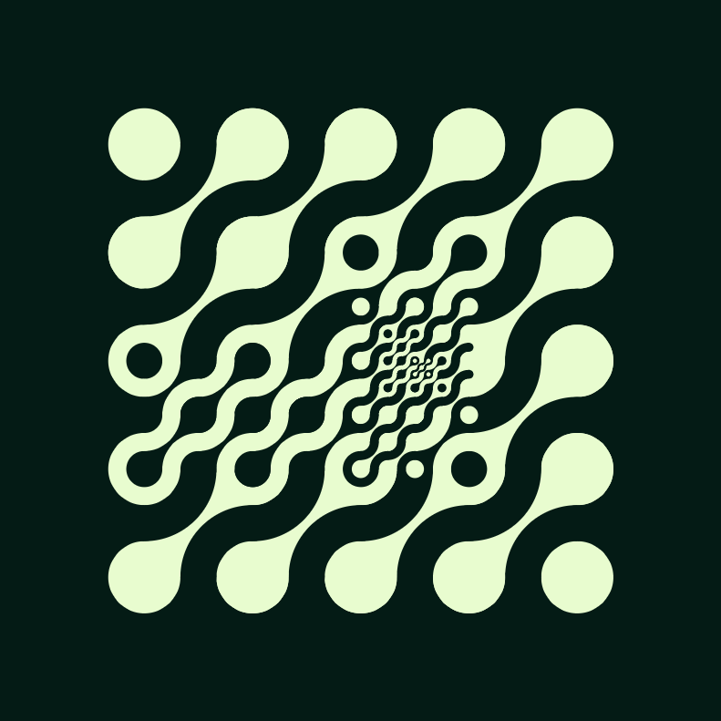
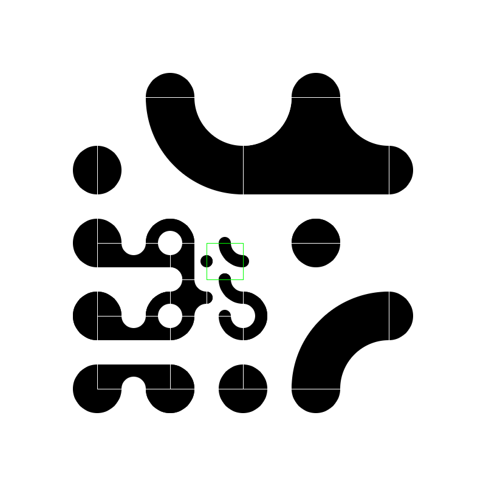

# Multiscale-Truchet
Clickable, multiscale truchet tiling generator in javascript

## Background
Javascript implementation of Christopher Carlson's algorithim:

https://christophercarlson.com/portfolio/multi-scale-truchet-patterns/

## Examples

## Todo

-[x] switch off and on the quadtree highlighting
-[] instantiate only the quadtree first, then put in the tiles
-[] quadtree pattern selector
-[] list of tiles selected for randomisation
-[x] scrollwheel changes tile
-[] righclick removes up to that top level of tree
-[] save button for photos
  -[] vector image save
-[] colour selector, saver
-[] completely change the data structure
